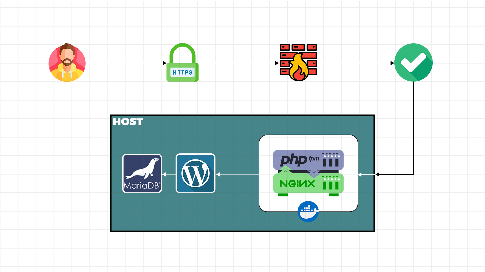

# Full LEMP Stack WordPress Deployment with Containers and SSL

## Overview


This project automates the deployment of a **LEMP (Linux, Nginx, MariaDB, PHP-FPM)** stack, designed to serve a **WordPress** application in a containerized environment. The stack uses **Docker** to run Nginx and PHP-FPM containers, while the MariaDB database runs natively on the host machine. By combining **Ansible** with Docker, this project aims to streamline and simplify the deployment process, providing a robust and scalable solution for web hosting.

Key features of this project include:

- **Automated Deployment**: The entire LEMP stack is deployed with a single playbook, including server provisioning, Docker installation, container orchestration, SSL certificate management, and firewall setup.
- **Modular Structure**: The project is structured using Ansible roles, each responsible for a specific part of the stack, such as setting up Nginx, PHP-FPM, MariaDB, and configuring iptables for security.
- **SSL Support**: SSL certificates are automatically obtained using **Certbot** and integrated with Nginx to ensure secure communication over HTTPS.
- **Containerized Nginx & PHP-FPM**: Nginx and PHP-FPM are run in Docker containers, providing isolation and flexibility, while the WordPress files are served via mapped volumes.
- **Customizable Configurations**: All configuration files, such as those for Nginx and PHP-FPM, are templated and easily customizable to fit different environments and application needs.
- **Efficient Resource Use**: By running the database outside of the containers and utilizing containers for stateless services, the stack ensures optimal performance and ease of maintenance.

Whether you're deploying a new WordPress site or looking to manage multiple sites with a consistent and scalable infrastructure, this project provides an end-to-end solution, leveraging the power of containers and automation.

This playbook includes roles for:
1. Provisioning the server
2. Managing users on remote server 
3. Configuring SSH
4. Installing and configuring MariaDB
5. Setting up WordPress
6. Obtaining SSL certificates 
7. Installing Docker and Docker Compose
8. Configuring and launching Docker containers
9. Applying firewall rules

## Roles

### 1. Server Provisioning

Updates server packages and installs essential tools.

**Variables Used:**
- None

### 2. User Management

This role creates a remote user, configures SSH access for the user, and optionally creates additional administrator accounts.

**Variables Used:**
- **`user_name`**: The username of the person running the playbook (automatically detected).
- **`teammate`**: Optional additional user for administrative access.

### 3. SSH Configuration

Enhances SSH security by changing the port, disabling root login, and enforcing key-based authentication.

**Variables Used:**
- **`port`**: Port for SSH (default is 22).

### 4. MariaDB Setup

Installs and configures MariaDB, creates a database and user for WordPress, and sets the bind address.

**Variables Used:**
- **`wp_db_name`**: Name of the WordPress database.
- **`wp_db_user`**: WordPress database username.
- **`wp_db_host`**: IP address for MariaDB binding (also used in WordPress configuration). 

### 5. WordPress Setup

Downloads, installs, and configures WordPress, including permissions and configuration files.

**Variables Used:**
- **`app_name`**: Name of the WordPress application (e.g., "wordpress").

### 6. SSL Certificate Configuration

Installs Certbot and obtains SSL certificates for the domain.

**Variables Used:**
- **`domain_name`**: Domain name for SSL certificates.
- **`ssl_email`**: Email address used for SSL registration.

### 7. Docker Installation

Installs Docker and Docker Compose  to run Nginx and PHP-FPM containers.

**Variables Used:**
- None

### 8. Docker Containers Setup (Nginx & PHP-FPM)

This role templates and mounts the configuration files for Nginx and PHP-FPM, and launches both services inside containers.

**Variables Used:**
- **`docker_compose_path`**: Path to the Docker Compose file.
- **`dockerfile_path`**: Path to the Dockerfile.
- **`ssl_cert_path`**: Path to the SSL certificate.
- **`ssl_key_path`**: Path to the SSL key.
- **`wordpress_root`**: Path to WordPress files.
- **`nginx_image`**: Nginx Docker image name.
- **`nginx_container_name`**: Nginx container name.
- **`nginx_conf_path`**: Path to the Nginx configuration file.
- **`php_fpm_image`**: PHP-FPM Docker image name.
- **`php_fpm_container_name`**: PHP-FPM container name.
- **`php_fpm_conf_path`**: Path to the PHP-FPM configuration file.
- **`app_network`**: Network name for the application.

### 9. Firewall Configuration (iptables)

Applies firewall rules to secure the server by restricting access to only necessary services and ports. Ensures that Nginx, PHP-FPM, and MariaDB can communicate with each other.

**Variables Used:**
- None

## How to Use

1. **Prepare Your Environment**: Ensure you have the necessary files and secrets.
2. **Run the Playbook**: Execute the main playbook to apply the roles and configure your server.

```bash
ansible-playbook -i inventory main-playbook.yml
```

## Author Information

This project is maintained by the following authors:

- **Bahy Ahmed** - [GitHub Profile](https://github.com/bahyahmed)  
  Email: biboacc0101@gmail.com

- **Mohamed Eid** - [GitHub Profile](https://github.com/moeid404)  
  Email: moeid404@gmail.com

Feel free to reach out to us for any questions, issues, or contributions.

